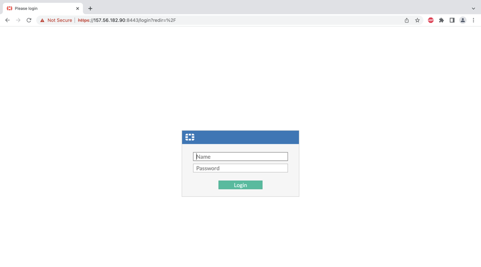
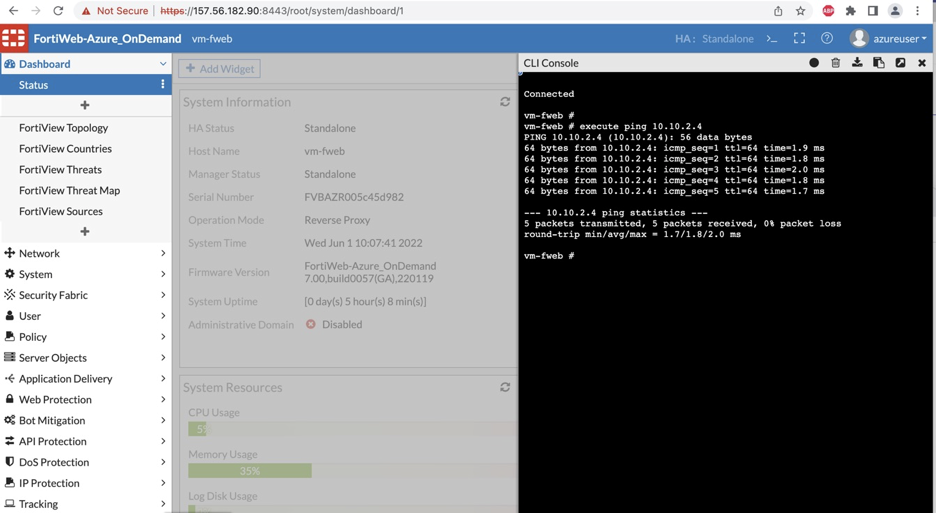
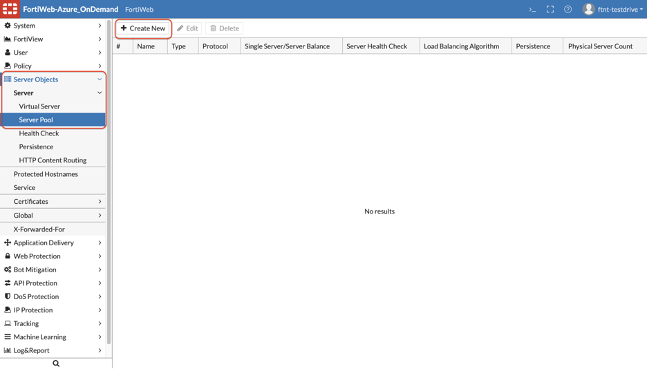
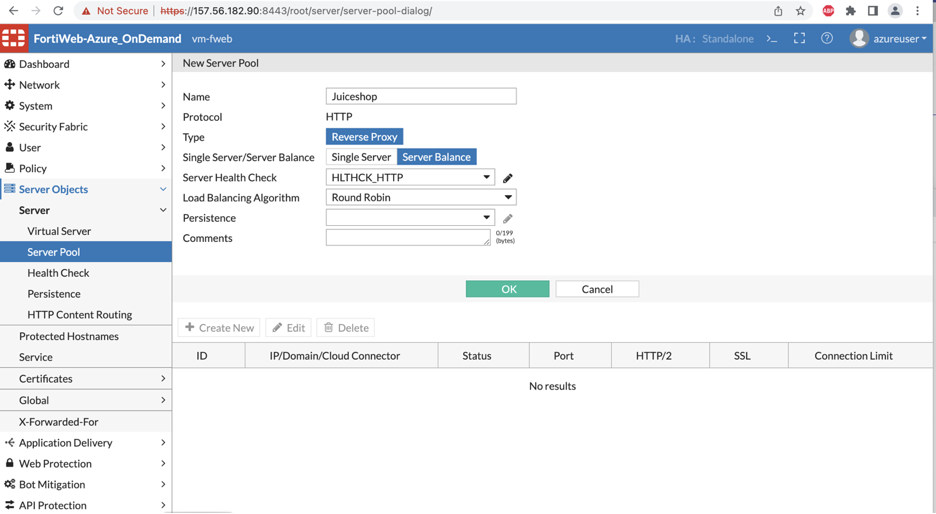
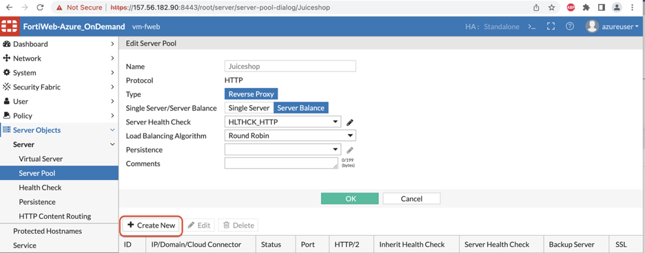
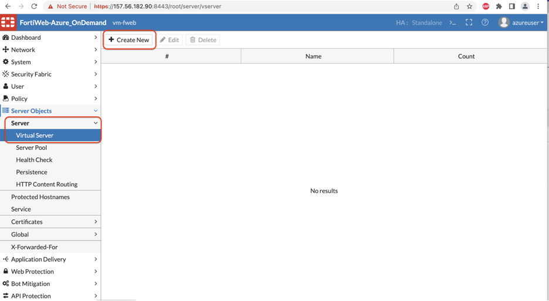
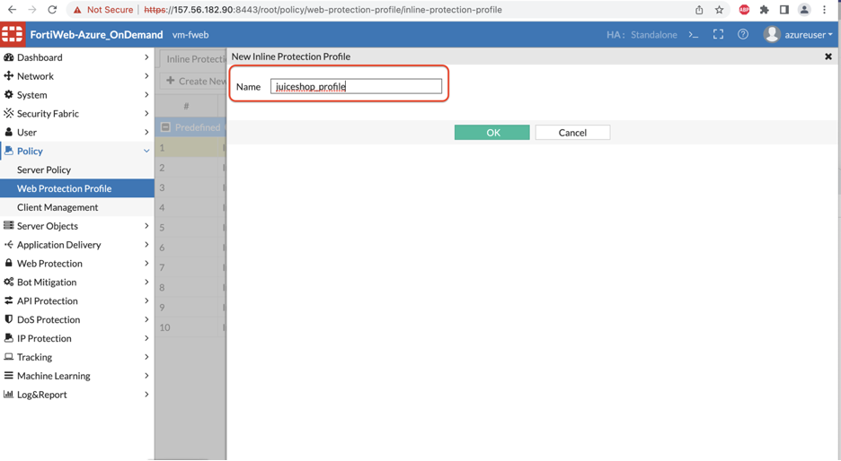
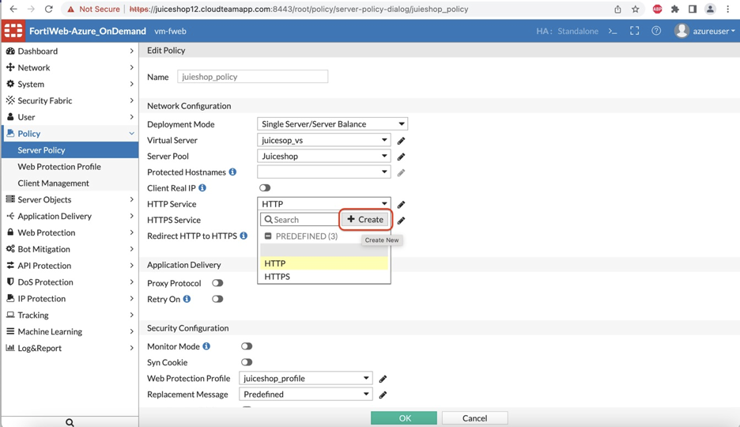
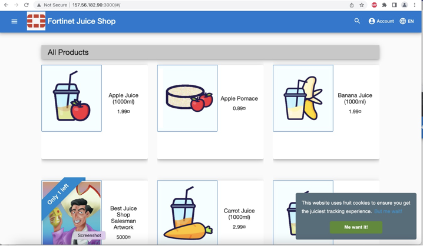
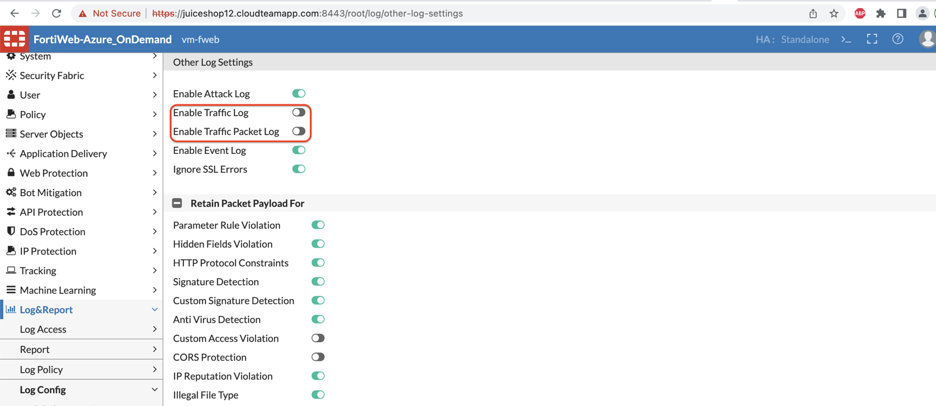

## Architecture for this lab:


### Initial Configuration/Setup:

1. Connect to Fortiweb by using the IP address corresponding to the Lab number assigned to you.

​		https://ipaddress:8443 or https://juiceshopX.cloudteamapp.com:8443 (X is your assigned Lab number)



 

2. The credentials will be provided during the lab time. Please login to the lab using those credentials.

   **username**: azureuser

   **password**: Password123!!

​		Once you login you will be at the dashboard.


3. Click on CLI Console to check the connectivity to the web server. 

```
execute ping 10.10.2.4
```



4. The application is hosted on a docker container which is up and running on Ubuntu server. We need to create the Server object for Fortiweb to send the traffic to application server.

​		Navigate to Server Objects >> Server >> Server Pool >> Create new



5. Input information as shown below. Select the Server Balance option for Server Health check option to appear. Click OK.



 

6. Once click OK in the above step the greyed out Create new button should now appear to create the Server object.



7. Now enter the IP address of your application server, port number the pool member/application server listens for connections. In this case the docker container for juice shop is listening on port 3000.


Click OK once you enter the information.

8. Now we will need to create the Virtual Server IP on which the Traffic destined for server pool member arrives. When FortiWeb receives traffic destined for a Virtual server it can then forward to its pool members. 

 

9. Enter the name for the Virtual Server and click OK. You can now click Create New to create the VIP object. 


 

10. Virtual Server item can be an IP address of the interface or an IP other than the interface. In this case we will use the interface IP - Turn on the Radio button for “use interface IP”, a drop down with interfaces will appear. Select Port1 as the interface for this Virtual Server item and click OK.


11. The Virtual Server for the Juice shop app is now using the IP address of the Port1 Interface. 


 

12. We will now create a custom protection profile which we will be using in the Server policy to protect the application Server. 

​		Navigate to Policy >> Web Protection Profile  click on Inline Standard 		protection >> Click Clone 


13. Create a custom Protection profile for juice shop, you can give a name of your choice. 

 

14. Now let’s create a Server policy. Input Name for the server policy, Select the Virtual Server, Server pool which we created in the earlier steps from the drop down. 

​	   For the HTTP Service, Click **create new**



15. Enter the port number the Virtual Server traffic will be reached on. Let’s keep this to 3000. **(Note: You can set up any port here or even can use HTTP/HTTPS. To make it easy for the rest of the lab use Port 3000)** 


 

16. Now let’s attach the protection profile you created in the earlier steps and click OK.


17. Now let’s Navigate to the browser and type the Public IP assigned to your FortiWeb instance to get to the web browser.

​	   http://FortiWebIP:3000 

​	  For example: http://157.56.182.90:3000



18. Before we move on to the next labs, enable Traffic Logging on Fortiweb. 

    Log & Report >> Log Config >> Enable traffic log and Enable Traffic Packet log



Navigate to Server Policy, edit the existing policy and Turn the Radio button for **Enable Traffic log**


Now for Machine Learning to collect the samples we would need a domain name for this Web application. The Domain names are already configured resolving to the public IP address of the Fortiweb. 

```
Markup : *The domain name for your application would be http://juiceshopX.cloudteamapp.com:3000 (**X is the Lab number assigned to you**)

Make sure you can reach to your juice shop through FQDN as well.

All of the attacks can be performed from the Kali Linux which is already set up for you. 

RDP into the Kali linux using attackerX.cloudteamapp.com (X is the lab number assigned to you)

Kali Username/Password: kali/CloudTeam

Once you have confirmed let’s proceed to the next Lab.

```