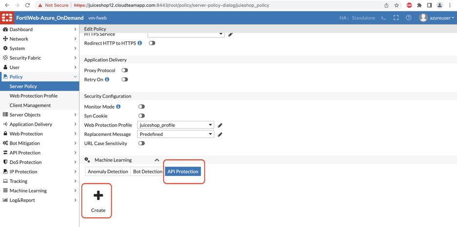
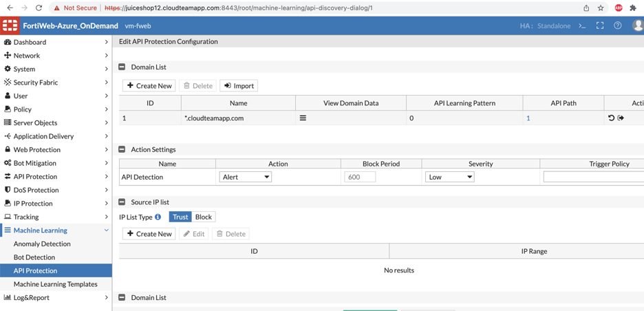
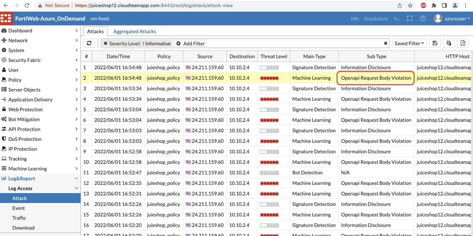

## Machine Learning - API protection:

1) For ML API protection, you will need to create the API Protection in Server Policy. Try on your own to enable the API protection….

 

 

 

 

​		If not help is right here ;) 

​		Server Policy >> double click the existing policy and scroll down to API protection. 

​		

2) Upload the dat file provided for ML API protection. 

3) Enter the domain name for the Juice shop. you can also use Wildcard Domain name. 



4) Verify by clicking on the domain data and see if at least one URL is in running state. The dat file you uploaded is trained ML model with API call to create users and with body Parameters of type string. 

​		For example, this was the request used to train the API ML model.

```
curl --location --request POST 'http://juiceshop12.cloudteamapp.com:3000/api/users' --header 'Content-Type: application/json' --data-raw '{"email": "test2.example.com", "password": “abcdefgh”}'
```


5) Let’s now generate the attack by running below cURL request or importing below request on POSTMAN.

```
curl --location --request POST 'http://juiceshop12.cloudteamapp.com:3000/api/users' --header 'Content-Type: application/json' --data-raw '{"email": "test3.example.com", "password": 123456789}'

```

```
curl -X POST 'http://juiceshop12.cloudteamapp.com/api/users' -H 'Content-Type: application/json' -d '{"email":"test3.example.com", "password": 123456789}'
```


6) Fortiweb will show an attack log with the API body violation since the password you have used is of type String. 



This concludes ML API learning Lab. 